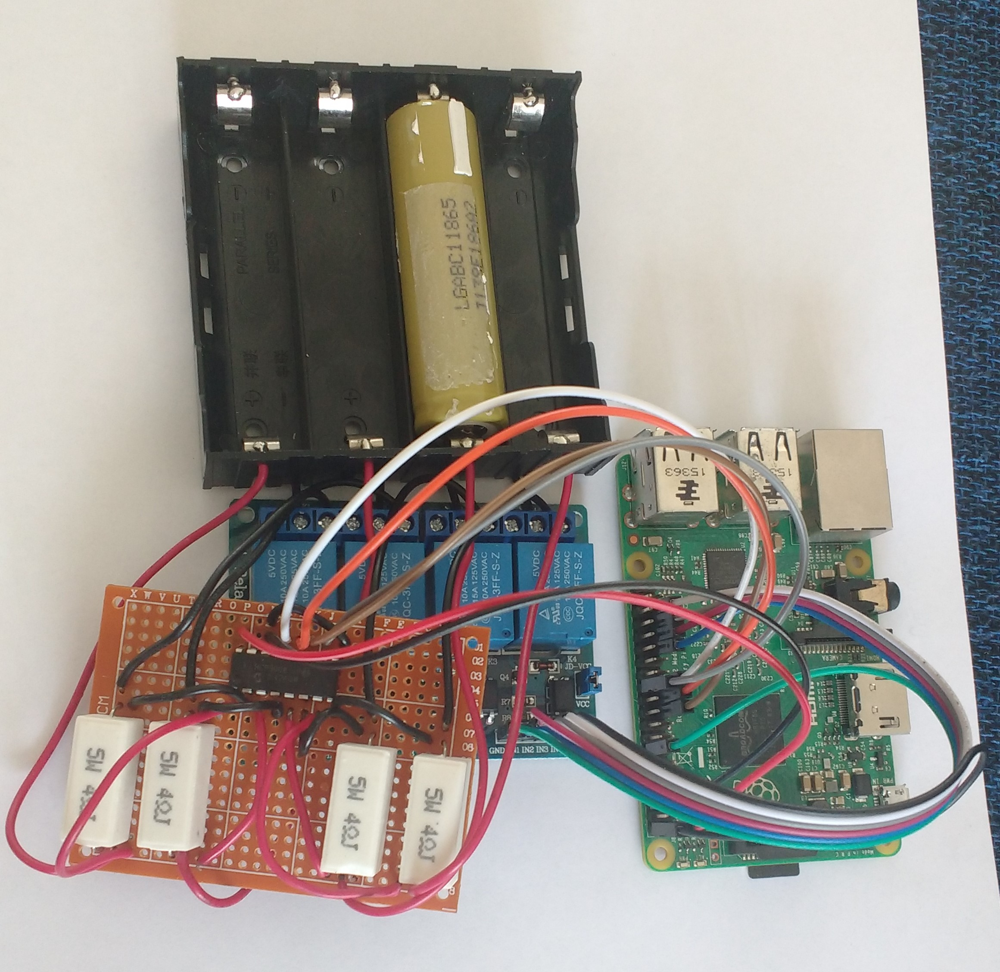

[](https://coveralls.io/github/Geocali/18650_tester?branch=master&service=github)

# Raspberry -based, 4-slots 18650 battery tester

This is an open source lithium-ion 18650 cells tester that discharges 4 batteries into 4 resistors, regularly records the current flowing, and deduces the total capacity of the cell.

It is quit handy if you have old laptop batteries that you want to test in order to create your own battery packs for a very cheap price.

Just put the charged cell in a slot, and the test starts automatically if the cell is charged. You can then follow the test on real-time curves.

At the end of the test, a csv file is created with the recorded voltages and capacity.

When one cell is tested, you can replace it independently of the others.


The advantages of this projects versus a commercial tester like the iMax B6 are:
- all slots are totally independent
- you can see the precise behaviour of the cell
- you can calculate your own metrics on each cell
- you can easily create statistics on the tested cells from the saved csv files
- you can extend it to manage more cells

From a programmer point of view, the project contains those following interesting points:
- how to mock a Raspberry with an SPI device (here an MCP3008 ADC) in order to easily create unit tests
- how to create unit tests for a Tkinter GUI

Planned improvements:
- use a constant discharge current
- record the initial voltage drop when the battery is put under load
- add an estimated remaining time during test

# Construction

## List of material

- 1x raspberry pi
- 1x 4-channel 5V relay
- 4x 4Ohm 5W resistors
- 1x MCP3008 Analog numeric converter
- 1x 4 slots battery holder
- 1x USB wifi dongle (optional)

## Wiring


Example of construction




# Set up your Raspberry

## Configure I2C

### Install the required libraries

```
sudo pip3 install --upgrade setuptools
sudo apt-get install -y python-smbus
sudo apt-get install -y i2c-tools
```

### Enable I2C

```
sudo raspi-config
```
In the menus, go to `Interfacing options`, then `I2C` and choose `YES`

Then, run

```
sudo reboot
sudo i2cdetect -y 1
```

## Configure SPI

Configure SPI with the following commands:

```
sudo raspi-config
Interfacing options / SPI / YES
sudo reboot
ls -l /dev/spidev*
```

## Install additional libraries
```
pip3 install -f requirements.txt
```

# Run the program

## Start the GUI that manages the testing of the batteries
```
python3 battery_tester/tkinter_app.py
```


# Use it

- First, charge your cells, for example with TP4056 cards.
- Start the raspberry and run the program
- Put the cells in the slots
- Once the test of a cell is finished, replace it with a new cell (wait for 10s before putting the new one)


# Contributing

Create a virtual environment:
```
pipenv install
```

Then
```
pipenv shell
```

Then, to run the tests, install pytest, and run the command ```pytest```